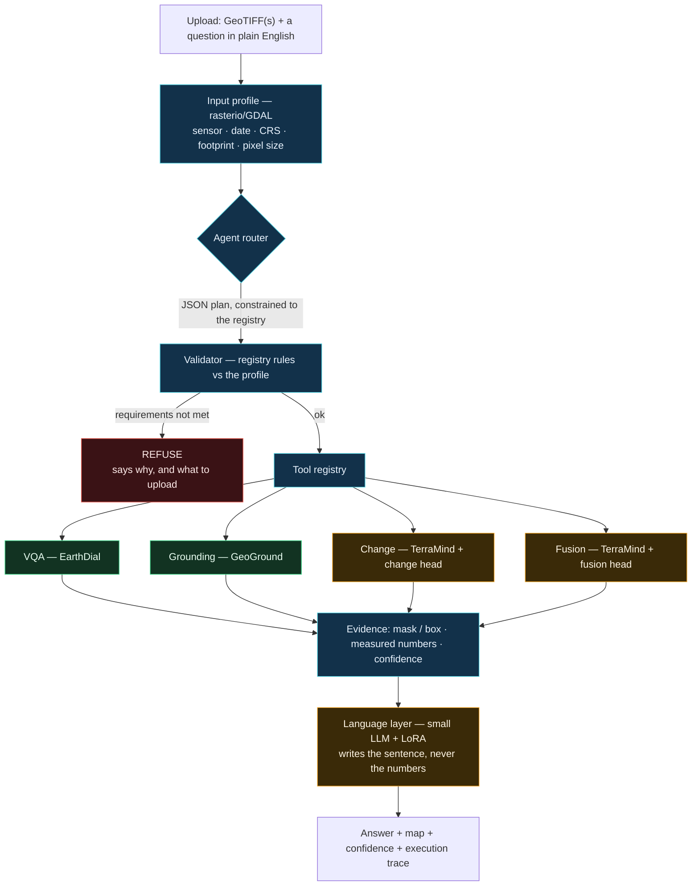
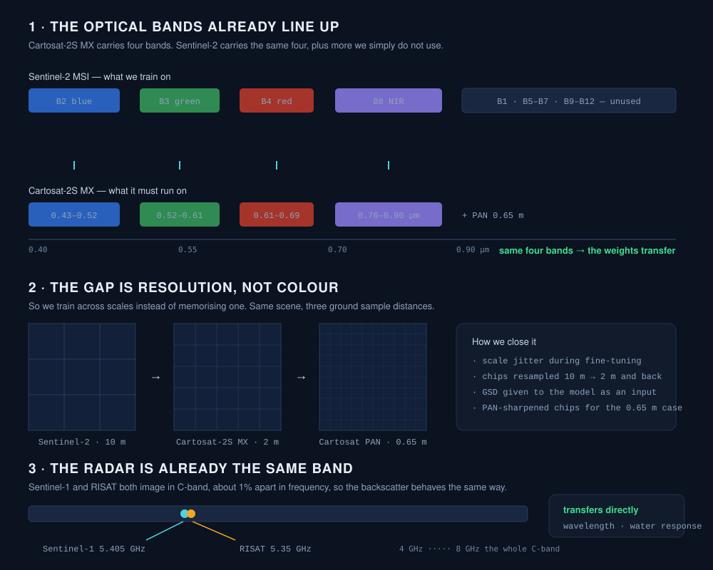

# SatQuery AI

**Ask a satellite image a question. Get an answer you can audit.**

An interactive vision–language assistant for multimodal remote sensing image analysis through text — Smart India Hackathon 2026, problem statement **SIH26167**.

▶ **[Interactive walkthrough — see the flow](https://satquery-ai.vercel.app)**

---

## What it does

Upload one image, an optical + radar pair, or the same place on two dates. Ask in plain English. Five things can happen:

| | Question | What comes back |
|---|---|---|
| **Ask** | *"Describe the land cover and major objects visible in this image."* | A description, with the regions it is talking about marked |
| **Locate** | *"Where is the water body in this scene?"* | A box or mask on the thing asked for |
| **Compare** | *"Has the built-up area increased, decreased, or remained unchanged?"* | A direct answer plus a change map |
| **Combine** | *"Use the optical and SAR images together to identify built-up and water-covered regions."* | One map from both sensors |
| **Refuse** | *"What changed between these images?"* — with one image uploaded | It says it cannot answer, and what to upload instead |

The last row is the point of the system. A generic assistant answers anyway.

---

## Architecture



<sub>Blue is our code · green is a frozen pre-trained model · amber is the small part we train · red is the refusal path.</sub>

**The rule that holds it together:** every spatial claim — a box, a mask, an area — comes from a vision model and is measured in code. The language layer only turns that evidence into a sentence. It is never asked where something is or how much of it there is.

---

## The agent router

<p align="center"></p>

The router is mostly plain Python. A model is used for exactly one decision — what the user is asking for — and even that answer is constrained to a fixed list. Everything that decides whether a model is *allowed* to run is ordinary code, which is why the system can refuse honestly.

### 1. Read the input

Before the question is even looked at, `rasterio` / GDAL open every uploaded file and build a profile:

- **Modality** — optical or SAR, from band count, band metadata and value distribution
- **Acquisition date**, **CRS**, **footprint**, **pixel size**

From those facts it derives what matters: how many images, whether the dates differ, whether the footprints overlap, whether the grids align. No AI is involved, so this step cannot hallucinate.

```text
profile = {
  files: 2,
  modalities: ["optical", "sar"],
  dates: ["2018-08-22", "2018-08-21"],
  same_area: true,          # footprint IoU above threshold
  co_registered: true,      # same CRS, same grid after reprojection
  gsd_m: 10
}
```

### 2. Plan the task

The small LLM with its LoRA reads the question and returns a plan as JSON:

```json
{ "tool": "fusion", "target": "water", "confidence": 0.93 }
```

Decoding is **constrained to a schema** (Outlines), so `tool` can only be a name that exists in the registry. The model cannot invent a tool, call an arbitrary function, or write free-form arguments. If the question fits no tool, it must say so.

The LoRA is trained on question → tool pairs built from public datasets: RSVQA and VRSBench questions for VQA, DIOR-RSVG referring expressions for grounding, CDVQA for change, and fusion questions we write ourselves in the same style.

### 3. Check before running

Every registry entry declares what it needs. A Pydantic rule set checks the plan against the profile from step 1:

| Tool | Model | Requires |
|---|---|---|
| `vqa` | EarthDial | 1 image |
| `grounding` | GeoGround | 1 image + a target to find |
| `change` | TerraMind + change head | 2 images · same modality · different dates · same area · co-registered |
| `fusion` | TerraMind + fusion head | 1 optical + 1 SAR · same area · acquisitions close in time |

If a requirement fails, nothing is loaded and the request is refused with the reason and the fix:

```text
CANNOT RUN
Temporal comparison needs two co-registered observations.
You uploaded 1 image and 1 acquisition date. Upload a second date to proceed.
```

Adding a new sensor or a new task means adding one entry to this table — not rewriting the router.

### 4. Run the specialist

The chosen model runs on prepared data: reprojected to a common grid, normalised, and cut into tiles the model's patch size expects. The backbone is frozen; only our small head produces the task output.

Then **code measures the result**, not the model: pixels in the mask × pixel area → hectares or km², per-class fractions, before/after differences. A number that appears in an answer can always be traced back to a specific mask and a specific pixel size.

Confidence combines the model's own scores (mean probability inside the mask, box score, answer token probability) with how sure the router was about the intent. Below a threshold the answer says so plainly instead of sounding certain.

### 5. Explain and log

The language layer receives the evidence package and nothing else:

```json
{
  "tool": "fusion",
  "mask_uri": "...",
  "measured": { "standing_water_km2": 66.1, "under_cloud_km2": 21.8 },
  "confidence": 0.79,
  "trace": ["validate", "route", "preprocess", "model", "head", "measure"]
}
```

It writes the sentence. A final check confirms that **every number in the sentence exists in the evidence**; if one does not, the answer is blocked rather than shown. The trace — each step, its duration, the model version, the checks that passed — is stored with the result and can be downloaded with it.

### How the backend handles a request

`FastAPI` receives the upload and the question and creates a job. Models are loaded once at start-up and stay resident, so a request is inference, not loading. The job moves through profile → plan → validate → execute → measure → compose, writing a trace record at each step; failures at any stage return a refusal with the reason instead of a partial answer. Everything runs in one container on one GPU server: **no external API call is made at any point**, so it can be deployed on-premise or air-gapped.

---

## Model choices

| Role | Model | Why | What we do to it |
|---|---|---|---|
| Visual question answering | **EarthDial** | Built for remote sensing conversation, handles multi-spectral input rather than plain RGB | Frozen |
| Grounding | **GeoGround** | Trained specifically to put boxes and masks on referred objects in overhead imagery | Frozen |
| Change and fusion | **TerraMind** | Pre-trained across 9 modalities including optical and SAR, so radar and optical already share one representation | Frozen backbone, we train a small change head and a small fusion head |
| Writing the answer | **A small instruction LLM** | Runs on-premise, big enough to write clearly, small enough to serve beside the vision models | LoRA adapter, trained on evidence → sentence and question → plan |

Only the heads and the LoRA are trained — a few million parameters against billions that stay fixed. That is what makes the whole thing trainable on modest hardware, and it is also why a new sensor does not mean a new pre-training run.

---

## Why not CR-JEPA

CR-JEPA is an attractive-looking option for this problem, and we looked at it seriously before choosing TerraMind. We contacted the authors directly. Two things came back:

1. **The pre-trained weights are not being released.** Without them, using CR-JEPA would mean pre-training a joint embedding model from scratch — which is a research project on its own, not something a prototype can rest on.
2. **It was evaluated for cross-modal retrieval**, meaning *find me the radar scene that matches this optical scene*. It was not evaluated for the analysis tasks this problem statement asks for: answering questions, locating objects, mapping change, or fusing sensors into one map.

A retrieval model learns to place two views of the same place near each other in an embedding space. That is genuinely useful, but it is a different job from producing a mask, a measured area, or a grounded answer, and a retrieval score says nothing about how well it would do those.

So CR-JEPA is not used. **TerraMind takes that role**: the weights are public, it was pre-trained across optical and radar together, and it has been evaluated on the kinds of dense prediction tasks we actually need.

We are describing the authors' position as they stated it to us, without naming them or quoting their correspondence.

---

## Data

| Dataset | What it gives us | Used for |
|---|---|---|
| **BigEarthNet-MM** | 549,488 paired Sentinel-1 + Sentinel-2 patches | Training the fusion head |
| **LEVIR-CD**, **OSCD** | Labelled before/after pairs | Training the change head |
| **RSVQA**, **VRSBench** | Question–answer pairs over overhead imagery | Router intent training, VQA evaluation |
| **DIOR-RSVG** | Referring expressions with boxes | Router intent training, grounding evaluation |
| **CDVQA** | Questions about change | Router intent training |

All of them are openly available, which means the whole pipeline can be trained and reproduced without a data agreement.

---

## Adapting to Indian satellites

The models above are trained on Sentinel data, because that is what exists openly and at scale. The system has to run on **Cartosat-2S** and **RISAT**. This is the part we designed most carefully, because it is where a proposal usually waves its hands.

<p align="center"></p>

**The optical case is better than it looks.** Cartosat-2S MX carries four bands — 0.43–0.52, 0.52–0.61, 0.61–0.69 and 0.76–0.90 µm — which are blue, green, red and near-infrared. Sentinel-2 carries exactly those four, among others. The features a model learns from *blue, green, red, NIR* are not Sentinel-specific; they are physics. What differs is resolution: 10 m against 2 m, and 0.65 m for the panchromatic band.

**The radar case is better still.** Sentinel-1 works at 5.405 GHz and RISAT at 5.35 GHz. Both are C-band, about 1% apart, so water, wet soil and built-up surfaces scatter the signal the same way in both. What differs is polarisation, resolution and speckle statistics — not the underlying response.

### How we train for it

<p align="center"></p>

**1 · Band subset.** We train using only the four Sentinel-2 bands that Cartosat-2S MX also carries, and drop the rest. The model therefore never learns to depend on a band the target sensor does not have. This costs a little accuracy on Sentinel and buys transferability.

**2 · Radiometry.** Both sources are converted to surface reflectance, then histogram-matched to Cartosat statistics. Without this, a sensor's brightness offset reads as real change — the classic false positive in cross-sensor change detection.

**3 · Scale.** Chips are resampled between 10 m and 2 m during training (scale jitter), and the ground sample distance is passed to the head as an input. The model learns *what a flooded field looks like*, not *what a flooded field looks like at 10 m*. For the 0.65 m panchromatic case we train on pan-sharpened chips.

**4 · Radar.** The radar head is trained on backscatter channels rather than a fixed VV/VH pair, so a RISAT scene with different polarisations is not out of distribution. Speckle characteristics are matched with filtering and augmentation.

**5 · Fine-tune and verify.** Only the heads and the LoRA are retrained — first on Sentinel scenes over India, which are free and plentiful, then on a small set of Cartosat and RISAT scenes. We report results **per sensor on held-out Indian scenes**, so the gap between what we trained on and what we deploy on is a measured number rather than an assumption.

The order matters: each stage removes one specific reason the model could fail on an Indian scene — a missing band, a brightness shift, a resolution change, a polarisation change — instead of hoping a single fine-tuning run absorbs all four at once.

---

## Evidence and audit

Every answer, whichever path produced it, carries the same four things:

- **The map** — the mask or box the claim is based on
- **The measured numbers** — computed from that mask in code, with the pixel size they came from
- **A confidence score** — from the model's own scores and the router's certainty
- **The execution trace** — what was checked, what was routed, what ran, and how long each step took

That package is what makes the answer checkable by someone who was not there when it ran, and it is the reason the system is allowed to say *no*.
